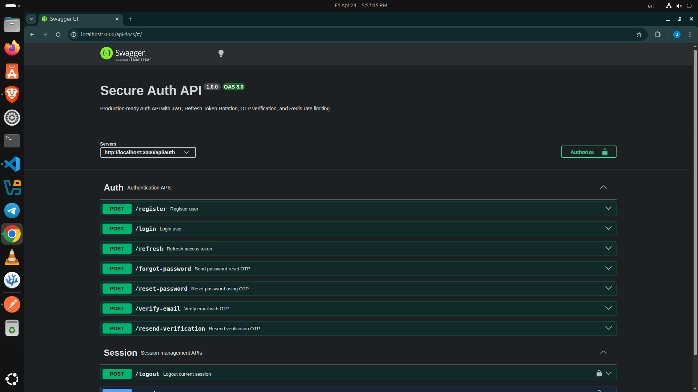

# 🔐 Secure Auth API (Node.js + Express + MySQL)

A **production-ready authentication API** built with Node.js, Express, MySQL, and Redis.
Designed with real-world security practices: JWT auth, refresh token rotation, OTP verification, rate limiting, and session management.

---

## 🚀 Features

### 🔑 Authentication

* JWT Access Token + Refresh Token
* Secure Refresh Token Rotation
* Refresh Token Reuse Detection

### 📧 Email & Verification

* Email Verification (OTP-based)
* Resend Verification OTP
* Password Reset via OTP

### 🔐 Security

* Password hashing (bcrypt)
* Redis-based Rate Limiting
* Brute-force protection (login throttling)
* Token hashing (stored securely in DB)
* HTTP-only cookies for refresh tokens

### 📱 Session Management

* Multi-device login support
* View active sessions
* Revoke specific sessions
* Logout (current device)

---

## 🧱 Tech Stack

* **Backend:** Node.js, Express
* **Database:** MySQL
* **Cache / Rate Limiting:** Redis
* **Auth:** JWT
* **Docs:** Swagger (OpenAPI)

---

## 📂 Project Structure

```
src/
├── config/         # DB, Redis, Mail, Env
├── controllers/    # Route handlers
├── services/       # Business logic
├── repositories/   # DB queries
├── middlewares/    # Auth, Rate limit, Error
├── routes/         # API routes
├── utils/          # Helpers (tokens, hashing, etc.)
└── server.js       # Entry point
```

---

## 📖 API Documentation

Interactive API docs available via Swagger:

```
http://localhost:3000/api-docs
```

👉 Test endpoints directly from your browser.

---

## ⚙️ Setup & Installation

### 1️⃣ Clone the repo

```bash
git clone https://github.com/shazzad-hosen/express-mysql-auth-api.git
cd express-mysql-auth-api
```

---

### 2️⃣ Install dependencies

```bash
npm install
```

---

### 3️⃣ Setup environment variables

Create a `.env` file:

```env
PORT=3000
NODE_ENV=development

DB_HOST=localhost 
DB_USER=root 
DB_PASSWORD=yourpassword 
DB_NAME=auth_db

JWT_ACCESS_SECRET=your_access_secret JWT_REFRESH_SECRET=your_refresh_secret

JWT_ACCESS_EXPIRY=15m
JWT_REFRESH_EXPIRY=7d

OTP_EXPIRY=10m

EMAIL_USER=your_email_user
EMAIL_PASS=your_email_password

REDIS_HOST=127.0.0.1
REDIS_PORT=6379
REDIS_PASSWORD=
```

---

### 4️⃣ Start services

Make sure:

* MySQL is running
* Redis is running

---

### 5️⃣ Run the server

```bash
npm run dev
```

---

## 🔐 Auth Flow

### Register

```
POST /api/auth/register
```

→ Creates user
→ Sends verification OTP

---

### Verify Email

```
POST /api/auth/verify-email
```

→ Activates account

---

### Login

```
POST /api/auth/login
```

→ Returns access + refresh tokens

---

### Refresh Token

```
POST /api/auth/refresh
```

→ Rotates refresh token securely

---

### Logout

```
POST /api/auth/logout
```

→ Deletes current session

---

## 🧠 Security Highlights

* Refresh tokens stored **hashed** (not raw)
* Token reuse detection (prevents stolen token attacks)
* Rate limiting with Redis (distributed safe)
* OTP expiration + secure verification flow
* Session-based device tracking

---

## 📸 Preview

> Swagger UI (API testing interface)



---

## 🧪 Testing

You can test endpoints using:

* Swagger UI (`/api-docs`)
* Postman / Thunder Client

---

## 📌 Future Improvements

* Role-based access control (RBAC)
* Audit logging system
* Docker support

---

## 🤝 Contributing

Contributions are welcome.
Feel free to open issues or submit pull requests.

---

## ⭐ Show Your Support

If you find this useful, give it a ⭐ on GitHub.

---

## 👨‍💻 Author

Built by: **Shazzad Hosen Zisan**

---

## 📜 License

MIT License
